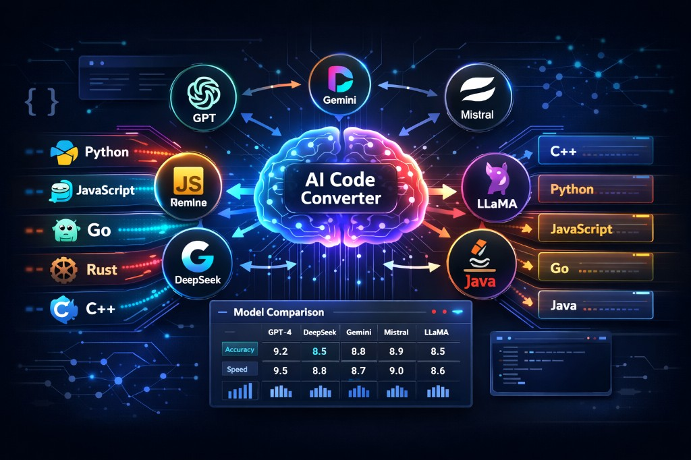

<div align="center">


# Multi-Language Code Converter

**Convert entire codebases between 23+ programming languages using Google Gemini.**

Upload a project, pick your source and target languages, review the results side-by-side, and download a ready-to-run ZIP.



[](https://react.dev)
[](https://vite.dev)
[](https://www.typescriptlang.org)
[](https://ai.google.dev)

</div>

---

## What It Does

Multi-Language Code Converter is a browser-based tool that sends your uploaded codebase to **Gemini 2.5 Pro**, requests an idiomatic conversion to the target language, and presents the results in an interactive UI:

- Browse original and converted project trees side-by-side
- View syntax-highlighted source alongside its converted counterpart
- Download the entire converted project as a ZIP with one click

The default pairing is **Python -> Rust**, but any combination of the supported languages works.

---

## Supported Languages

| | | | |
|---|---|---|---|
| Python | JavaScript | TypeScript | Java |
| Go | Rust | C | C++ |
| C# | Ruby | PHP | Swift |
| Kotlin | Scala | Dart | R |
| Perl | Shell Script | Julia | MATLAB |
| Fortran | COBOL | Lisp | |

Gemini is instructed to preserve business logic, use idiomatic APIs for the target language, and retain all comments and documentation.

---

## Prerequisites

- **Node.js** >= 18
- A **Google Gemini API key** (obtain one from [Google AI Studio](https://aistudio.google.com))

---

## Getting Started

**1. Clone the repo**

```bash
git clone https://github.com/<your-username>/code-converter.git
cd code-converter
```

**2. Install dependencies**

```bash
npm install
```

**3. Set your API key**

Create a `.env` file in the project root:

```
API_KEY=your_gemini_api_key_here
```

> Never commit your real API key to version control.

**4. Start the dev server**

```bash
npm run dev
```

Open the printed local URL (typically `http://localhost:5173`) in your browser.

---

## Usage

1. **Upload** -- Click *Select Project Folder* to upload a full directory, or *Select Files* for individual files.
2. **Choose languages** -- Pick the source language that matches your code and the target language you want.
3. **Convert** -- Hit *Convert Code* and wait while Gemini processes the project.
4. **Explore** -- Browse the original and converted file trees, click any file to see its code side-by-side.
5. **Download** -- Click *Download ZIP* to save the converted project as `converted-project.zip`.

---

## Project Structure

```
.
├── App.tsx                      # Main UI, conversion flow, side-by-side display
├── index.tsx                    # React entry point
├── constants.ts                 # Supported languages and metadata
├── types.ts                     # Shared TypeScript types
├── services/
│   └── geminiService.ts         # Gemini client, prompt construction, response parsing
├── components/
│   ├── Header.tsx               # App header
│   ├── LanguageSelector.tsx     # Source / target language pickers
│   ├── FileTree.tsx             # Collapsible file tree view
│   ├── CodeDisplay.tsx          # Syntax-highlighted code viewer
│   ├── Loader.tsx               # Conversion progress indicator
│   ├── ConfirmationDialog.tsx   # Confirmation modal
│   ├── Toast.tsx                # Individual toast notification
│   └── ToastContainer.tsx       # Toast stack container
├── context/
│   └── ToastContext.tsx         # Toast notification context provider
├── assets/
│   └── banner.png               # Project banner image
└── vite.config.ts               # Vite configuration
```

---

## Tech Stack

| Layer | Technology |
|---|---|
| Framework | React 19 |
| Bundler | Vite 6 |
| Language | TypeScript 5.8 |
| AI Model | Google Gemini 2.5 Pro (`@google/genai`) |
| ZIP Export | JSZip + FileSaver |

---

## Security and Privacy

- Files are processed in the browser and sent only to the Gemini API endpoint.
- Do not upload code containing secrets, API keys, or other sensitive credentials.
- Always review converted output before using it in production.

---

## Contributing

Contributions are welcome. Fork the repository and open a pull request with your improvements, whether that is new language presets, better diffing, framework-aware conversion rules, or anything else.

---

## License

This project is provided as-is. Add a license file (e.g. MIT) if you plan to distribute it publicly.
